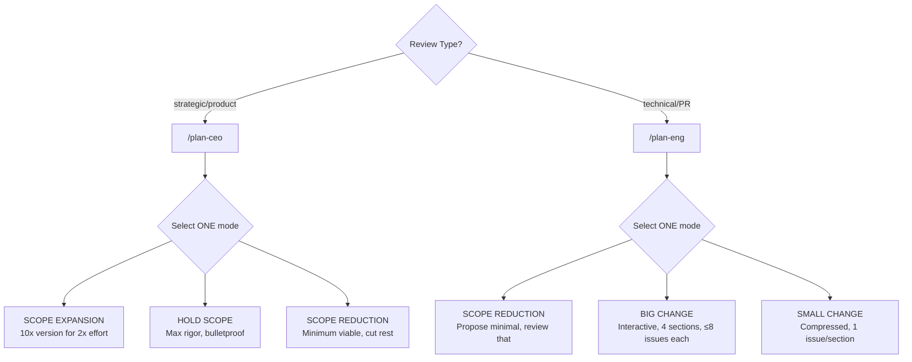
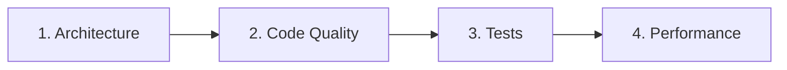
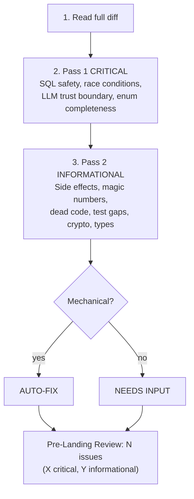

# CLAUDE.md — BidDeed.AI / Everest Capital USA

## Identity
```yaml
founder: Ariel Shapira
company: BidDeed.AI / Everest Capital USA
experience: 10+ yr foreclosure investing, Brevard County FL
licenses: FL broker, general contractor
style: direct, no softening, facts+actions
adhd: systems must self-run
```

## Stack
```yaml
repos: github.com/breverdbidder/*
  active: [cli-anything-biddeed, zonewise-scraper-v4, biddeed-ai, biddeed-ai-ui, zonewise-web, cliproxy-gateway, tax-insurance-optimizer]
db: Supabase mocerqjnksmhcjzxrewo.supabase.co
  tables: [multi_county_auctions(245K), activities, insights, daily_metrics]
compute: Hetzner 87.99.129.125 (CLIProxyAPI 127.0.0.1:8317)
ai:
  free: Gemini Flash (CLIProxyAPI) — DEAD, keys expired
  cheap: DeepSeek V3.2 ($0.28/1M)
  primary: Claude (Max plan, never API)
deploy: [GitHub Actions, Cloudflare Pages, Render]
brand: { primary: "#1E3A5F", accent: "#F59E0B", font: Inter, bg: "#020617" }
```

## 3-Layer CLAUDE.md Hierarchy (Claude Architect Standard)
```yaml
layer_1_user: ~/.claude/CLAUDE.md  # personal prefs, not version-controlled
layer_2_project: ./CLAUDE.md       # THIS FILE — team rules, architecture, triggers
layer_3_path_rules: .claude/rules/ # pattern-matched, loaded ONLY when editing matching files
  deployed: [components(src/components/**), pages(src/pages/**), api-calls(src/lib/**)]
  principle: lean context window — rules load only when relevant
  enforcement: hooks for 100% reliability (finance/security), prompts for style/tone
```


## Context Rules
```yaml
triggers:
  auction_or_property: query Supabase multi_county_auctions first
  case_number: search multi_county_auctions.case_number
  deal_analysis: apply (ARV×70%)-Repairs-$10K-MIN($25K,15%×ARV)
  pipeline_health: check daily_metrics + recent GHA runs
  county_mention: verify counties/ config exists before assuming
  build_request: follow cli-anything HARNESS.md 7-phase
  deploy: push to GitHub, never local/GDrive
  spend_over_10: STOP and confirm
  context_switch: flag "📌 [previous task] still open"
  summit: execute immediately, zero questions
```

## Work Principles
```yaml
rules:
  - execute first, report results
  - $10/session max, batch ops, one attempt per approach
  - zero HITL: 3 alternatives before surfacing blocker
  - push back with strong opinions when disagreeing
  - wrong = "I was wrong", never invent numbers
```

## Slash Commands
```yaml
commands:
  /auction-brief: morning auction briefing from Supabase
  /county-setup: onboard new FL county
  /deal-intel: process foreclosure docs → structured data
  /tldr: end-of-session summary, update memory.md
  /transcript: YouTube video analysis via Hetzner pipeline
```

## Family
```yaml
wife: Mariam (Property360 real estate, Protection Partners insurance, contracting)
son: Michael (16, D1 swimmer, Satellite Beach HS, keto diet, Shabbat)
observance: Orthodox (Shabbat Fri sunset–Sat havdalah, kosher, holidays)
```

## Session Hygiene (Mar 15, 2026)

### Mandatory Plugins
```yaml
plugins:
  context7: { purpose: live API docs, install: "/plugin → context7", cost: $0 }
  claude-2x-statusline: { purpose: context monitor, install: "git clone https://github.com/Nadav-Fux/claude-2x-statusline.git ~/.claude/cc-2x-statusline && bash ~/.claude/cc-2x-statusline/install.sh", tier: Full, repoeval: 86 }
  supabase-cli: { purpose: autonomous migrations, install: "npm i -g supabase && supabase link --project-ref mocerqjnksmhcjzxrewo", project: mocerqjnksmhcjzxrewo, zero_hitl: true }
  cctop: { purpose: sessions dashboard, install: "curl -fsSL https://raw.githubusercontent.com/DeanLa/cctop/main/install.sh | bash", fork: breverdbidder/cctop }
```


### Supabase CLI — Autonomous Operations (Apr 4, 2026)
```yaml
supabase_cli:
  auth: SUPABASE_ACCESS_TOKEN (sbp_ token)
  project: mocerqjnksmhcjzxrewo
  autonomous_ops:
    - supabase db push          # Apply migrations — NO HITL
    - supabase db diff           # Generate migration from schema changes — NO HITL  
    - supabase migration new     # Create new migration file — NO HITL
    - supabase db reset          # BLOCKED — requires Ariel approval (production data)
    - supabase functions deploy  # Edge functions — NO HITL
  migration_workflow:
    1: "supabase migration new <name>"
    2: "Write SQL in supabase/migrations/<timestamp>_<name>.sql"
    3: "supabase db push"
    4: "Verify via REST API or psql"
    5: "Commit migration file to repo"
  never_ask_ariel:
    - CREATE TABLE / ALTER TABLE (non-destructive)
    - CREATE INDEX / CREATE FUNCTION
    - INSERT/UPDATE to non-critical tables
    - RLS policies
  always_ask_ariel:
    - DROP TABLE / TRUNCATE on production tables
    - Schema changes to billing/payment tables
    - supabase db reset
```

### Context Window Rules
```yaml
rules:
  context_brackets:
    FRESH_gt70pct: "Full file reads OK. Complex multi-step work OK. Parallel ops OK."
    MODERATE_40_70pct: "Re-read STATE before decisions. Summaries over full files. Single-concern tasks."
    DEEP_20_40pct: "Finish current task ONLY. Prepare session summary. No new complex work."
    CRITICAL_lt20pct: "Write session summary NOW. Update TODO.md. No new file reads. Exit."
  never_compact: loses working context, keeps stale — always fresh start
  sub_agents: dispatch via Superpowers for heavy work
  harness_checkpoint: save state + restart if >50% mid-pipeline
cc_status_line:
  line1: "model | context% | session_cost | session_clock"
  line2: "git_branch | git_worktree"
```

---

## Loop Discipline (Mar 25, 2026)

### Evidence-Before-Claims (upgrades NEVER-LIE)
```yaml
# The evidence chain: Execute → Verify → Read output → Compare to spec → THEN claim.
# Breaking ANY link = false completion.
anti_rationalization:
  "Should work now":           "Run the verify command and read its output"
  "I already checked this":    "Check it again fresh — memory of checking ≠ verification"
  "It's close enough":         "Compare against the AC/spec word by word"
  "The test passes":           "Also compare against the spec — tests can be incomplete"
  "This is a minor deviation": "Log it explicitly — minor deviations compound into drift"
  "I'm confident it works":    "Run it and prove it — confidence without evidence is failure cause #1"
rules:
  - NEVER mark a task [x] in TODO.md without fresh verification evidence in same session
  - NEVER claim a DB count, %, or metric without running the actual query first
  - When wrong: say "I was wrong" — not "I misspoke" or "let me clarify"
```

### Scope Classification (pre-step to all tasks)
```yaml
# Before executing ANY task, classify scope FIRST:
scope_classification:
  quick_fix:
    signals: "Fits 1 sentence AND 1-2 files AND no architectural implications"
    ceremony: "No spec. Execute directly. Mark [x] with 1-line commit."
  standard:
    signals: "3-5 files OR design decision needed OR multiple components"
    ceremony: "Spec recommended. Full protocol. Session summary required."
  complex:
    signals: "6+ files OR architectural change OR multi-repo OR new patterns/deps"
    ceremony: "Spec MANDATORY (BRAINSTORM_PROTOCOL). Must split into sub-tasks."
# Classify BEFORE work starts. When uncertain → choose HIGHER ceremony.
```

### Boundaries Enforcement
```yaml
# Every spec/plan SHOULD include a boundaries section.
# When present, boundaries are HARD constraints, not suggestions.
boundaries:
  DO_NOT_CHANGE: "STOP and confirm before ANY modification to listed items"
  SCOPE_LIMITS: "Log to deferred issues if encountered, do not address"
# No boundaries in spec? → ask once at session start: "Any files I should avoid touching?"
# SUMMIT-dispatched work → treat spec as full scope, nothing beyond it.
```

### Session Summary Loop Closure
```yaml
# Every session summary MUST include (in addition to Status Board):
loop_closure:
  plan_vs_actual: "| Task | Planned | Actual | Deviation | — ALWAYS required"
  deviation_log: "What changed, why, downstream impact — required if any deviation"
  verification_evidence: "Command run → output observed → spec comparison — required if any task completed"
# The session summary IS the loop closure. No summary = orphaned loop.
# Evidence-Before-Claims applies: don't claim DONE without proof in the summary.
```


# GSTACK PATTERNS
```yaml
source: garrytan/gstack (MIT)
deployed: Mar 17, 2026
fork: breverdbidder/gstack
```

## AskUserQuestion Format (MANDATORY)
```yaml
format:
  1_reground: project + branch + current task (1-2 sentences)
  2_eli16: plain English a 16yo follows, no jargon, concrete examples
  3_recommend: "RECOMMENDATION: Choose [X] because [reason]"
  4_options: "A) ... B) ... C) ..."
assumption: user hasn't looked in 20 min, no code open
```

## Review Modes



### CEO Mode Directives
```yaml
directives:
  - zero silent failures — every failure mode visible
  - every error has a name — specific exception, not "handle errors"
  - data flows have shadow paths — nil, empty, upstream error
  - diagrams mandatory — Mermaid for every new data flow
  - deferred = written in TODOS.md or doesn't exist
  - optimize for 6-month future
  - permission to say "scrap it and do this instead"
critical: once mode selected, NEVER drift to another
```

### Eng Mode Sections

```yaml
eng_sections:
  architecture: [system design, dependencies, coupling, scaling, security, failure scenarios]
  code_quality: [DRY, error handling, edge cases, tech debt, over/under-engineering]
  tests: [diagram UX/data/code flows, verify test exists, check eval.json]
  performance: [N+1 queries, unbounded selects, missing indexes, recomputation]
rule: STOP after each section, present issues one-at-a-time, resolve before next
```

## Fix-First Review (MANDATORY)


## visual-explainer Skill
```yaml
source: ~/.claude/skills/visual-explainer/plugins/visual-explainer/SKILL.md
output: ~/.agent/diagrams/ (open in browser)
commands: [/diff-review, /plan-review, /project-recap, /generate-web-diagram, /generate-slides, /fact-check]
brand: templates/biddeed-brand-preset.html
auto_trigger: "table 4+ rows OR 3+ columns → HTML, never ASCII"
```


<!-- KARPATHY_DISCIPLINE_BEGIN v1.0 -->
## Behavioral Discipline (Karpathy Guidelines)

> Adapted from [forrestchang/andrej-karpathy-skills](https://github.com/forrestchang/andrej-karpathy-skills) · MIT License · ~14k★ · Karpathy-starred.
> Adopted by Everest Capital 2026-04-12. This section is **complementary** to the existing HONESTY PROTOCOL, PAIRING RULE, COST DISCIPLINE, and CLI-ANYTHING mandates above — it does not replace them.

**Tradeoff posture:** These guidelines bias toward caution over speed. For trivial tasks (typo fix, one-line config), use judgment and skip the ceremony.

### K1. Think Before Coding *(reinforces HONESTY PROTOCOL)*

Don't assume. Don't hide confusion. Surface tradeoffs.

- State assumptions explicitly. If uncertain, label as `INFERRED` per HONESTY PROTOCOL.
- If multiple interpretations exist, present them — don't pick silently.
- If a simpler approach exists, say so. Push back when warranted.
- If something is unclear, stop. Name what's confusing. Ask.

**Everest delta:** when an assumption is surfaced, it must carry a `VERIFIED / UNTESTED / INFERRED` tag. Wrong `VERIFIED` = 3× penalty to honesty_violations table.

### K2. Simplicity First *(complements XGBoost efficiency cap)*

Minimum code that solves the problem. Nothing speculative.

- No features beyond what was asked.
- No abstractions for single-use code.
- No "flexibility" or "configurability" that wasn't requested.
- No error handling for impossible scenarios.
- If you write 200 lines and 50 would do, rewrite.

Ask: "Would a senior engineer call this overcomplicated?" If yes, simplify.

**Everest delta:** this is per-diff. XGBoost efficiency (90 min/chat, max 3 chats/task) is per-session. Both apply.

### K3. Surgical Changes *(NEW — closes AUTOLOOP evolver bloat gap)*

Touch only what you must. Clean up only your own mess.

When editing existing code:
- Don't "improve" adjacent code, comments, or formatting.
- Don't refactor things that aren't broken.
- Match existing style, even if you'd do it differently.
- If you notice unrelated dead code, **mention it — don't delete it.**

When your changes create orphans:
- Remove imports/variables/functions that YOUR changes made unused.
- Don't remove pre-existing dead code unless explicitly asked.

**The test:** every changed line must trace directly to the user's request.

**Everest delta — AUTOLOOP V2 evolver constraint:** prompt/rule updates produced by the evolver must be **minimal and surgical**. Diffs that exceed 20% line growth or touch sections unrelated to the failing case must be rejected by the evolver's self-check and re-attempted with a narrower edit. This closes the bloat failure mode flagged by Dylan Cleppe's extraction-funnel analysis (2026-04-12) and by Karpathy directly.

### K4. Goal-Driven Execution *(complements EG14 gate)*

Define success criteria. Loop until verified.

Transform tasks into verifiable goals:
- "Add validation" → "Write tests for invalid inputs, then make them pass"
- "Fix the bug" → "Write a test that reproduces it, then make it pass"
- "Refactor X" → "Ensure tests pass before and after"

For multi-step tasks, state a brief plan:
```
1. [Step] → verify: [check]
2. [Step] → verify: [check]
3. [Step] → verify: [check]
```

Strong success criteria let you loop independently. Weak criteria ("make it work") require constant clarification.

**Everest delta:** for SUMMIT dispatches touching production (zonewise-web, dify-zonewise, nexus), the EG14 14-point enterprise gate is the canonical success criteria. Goal-driven execution at the sub-task level must compose up to an EG14 verdict, not replace it.

### Working indicators

These guidelines are working if:
- Fewer unnecessary changes appear in diffs.
- Fewer rewrites happen due to overcomplication.
- Clarifying questions arrive *before* implementation, not after mistakes.
- AUTOLOOP evolver prompt diffs stay small and targeted.

### Attribution

Source: https://github.com/forrestchang/andrej-karpathy-skills (MIT)
Upstream quote from Karpathy: *"LLMs are exceptionally good at looping until they meet specific goals. Don't tell it what to do, give it success criteria and watch it go."*
<!-- KARPATHY_DISCIPLINE_END v1.0 -->
